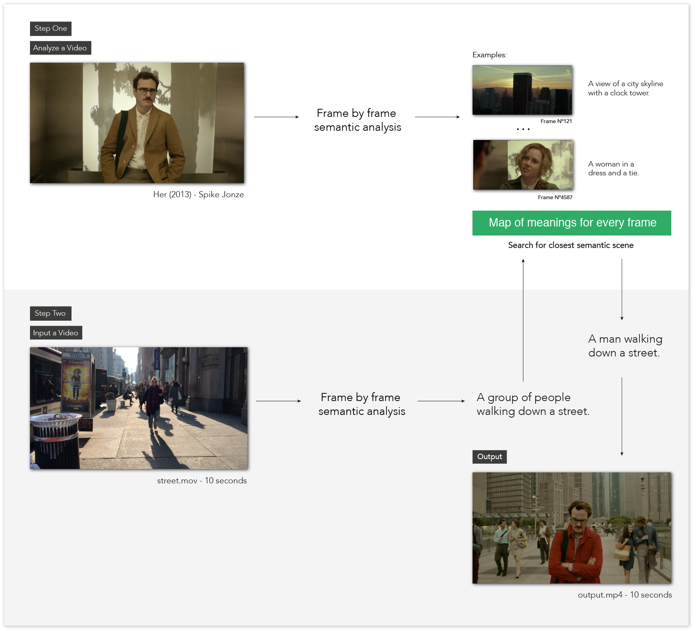

Scenescoop is a tool to get similar semantic scenes from a pair of videos. Basically, you input a video and get a scene that has a similar meaning in another video.

<iframe src="https://www.youtube.com/embed/ZF5W_tcnF4s" style="position:absolute;width:100%;height:100%;left:0" width="791" height="460" frameborder="0" allow="autoplay; encrypted-media" allowfullscreen></iframe>

<iframe src="https://www.youtube.com/embed/aaYVMsMMEjc" style="position:absolute;width:100%;height:100%;left:0" width="791" height="460" frameborder="0" allow="autoplay; encrypted-media" allowfullscreen></iframe>

Scenescoop uses the im2text tensorflow model to analyze videos on a frame to frames basis and get a description of the content of those images. Frames with the same description are grouped together to create a sequence or scene.

  

  

