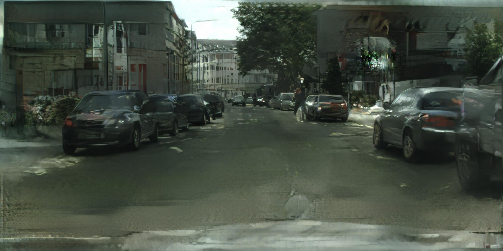

Uncanny Rd. is a drawing tool that allows users to interactively synthesise street images with the help of Generative Adversarial Networks (GANs). The project uses two AI research papers published this year as a starting point (Image-to-Image Translation Using Conditional Adversarial Networks by Isola et al. and High-Resolution Image Synthesis and Semantic Manipulation with Conditional GANs by Wang et al.) to explore the new kinds of human-machine collaboration that deep learning can enable.

<iframe src="https://player.vimeo.com/video/250328464?color=ffffff&title=0&byline=0&portrait=0" style="position:absolute;top:0;left:0;width:100%;height:100%;" frameborder="0" webkitallowfullscreen mozallowfullscreen allowfullscreen></iframe>

Users of Uncanny Rd. interact with a semantic colormap of a scene, where each color represents a different kind of object label (e.g. road, building, vegetation, etc.). The neural network model was trained using adversarial learning on the Cityscapes dataset, which contains street images from a number of German cities.

  

As Andrej Karpathy notes, neural networks will enable a whole new generation of software, which he terms Software 2.0. Unlike Software 1.0, in which creators have to write in code the exact behavior of their programs, creators of Software 2.0 spend their time collecting, labeling, and preprocessing data to “guide” the program towards producing their desired output.

  

  

  

There are advantages and disadvantages to this new paradigm that are apparent to anyone who plays with Uncanny Rd for a few minutes: on the one hand, the neural network can produce images of astonishing fidelity from a very generic high-level representation (the semantic map). On the other hand, the user has very limited control over how the final image will look like — which makes the interface useful for brainstorming and exploration but not for bringing to life a specific creative vision. The way forward is finding ways to combine the power of neural networks with more traditional symbolic approaches.

  

  

  

  

